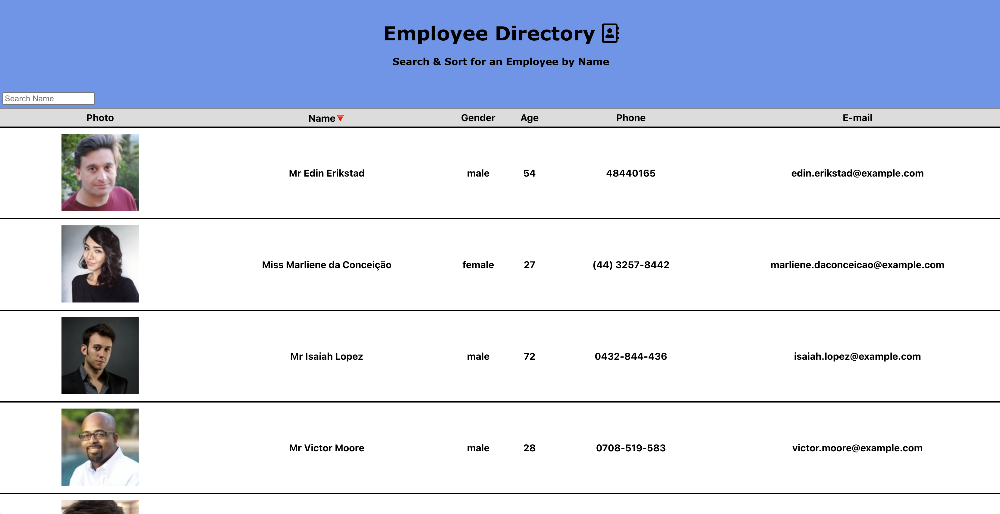
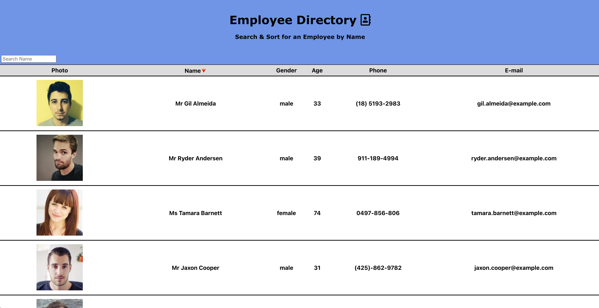
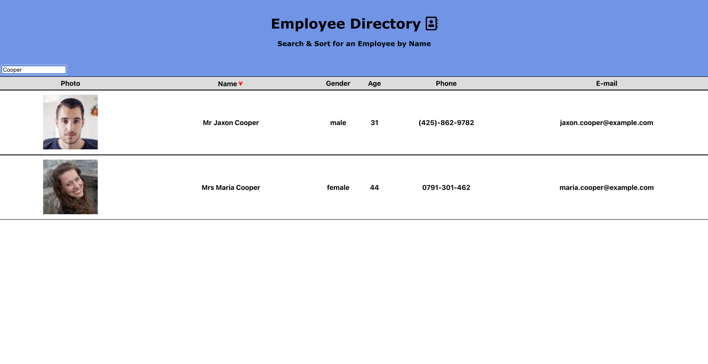

# Unit 19 React Homework: Employee Directory

## Description

My assignment was to create an employee directory app and break up its UI into components while managing the component state, and making it respond to user events.  The employee directory names and info is generated from an API.  I created functionality to enable the user to sort and filter/search employees by name.  To search by name, simply type in the name of the employee in the search field in the upper-left area of the app.  To sort by name, the user has to click "Name" or the upside-down red triangle next to it in the column header.

For this app, I utilized React JS and deployed it on GitHub Pages.

## Table of Contents 

* [Deployment](#deployment)

* [Screenshots](#screenshots)

* [Author](#author)

## Deployment
### GitHub Pages Link
[Click here](https://edonohue8.github.io/react-employee-directory/)

## Screenshots

* **Table of Employees from API**

* **Sorting Employees by Name**

* **Filtering/Searching Employees by Name**

## Author

* **Eric Donohue**

### Other Projects

Please visit [edonohue8](https://github.com/edonohue8/) to see more of my projects.